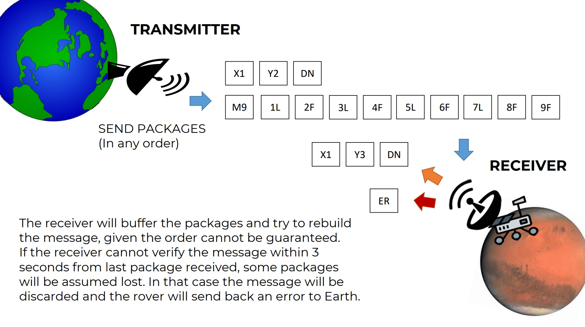

---

## Connascent Mars Rover

### Problem

The squad of rovers has been proved hard to manage, so in this version there will be only one rover deployed to Mars. The plateau, which is curiously rectangular, must be navigated by the rovers so that their on-board cameras can get a complete view of the surrounding terrain to send back to Earth.

The rover’s position and location is represented by a combination of x and y co-ordinates and a letter representing one of the four cardinal compass points. The plateau is divided up into a grid to simplify navigation. An example position might be 0, 0, N, which means the rover is in the bottom left corner and facing North.

In order to control a rover, NASA has found some problems in the past way to communicate. The issue is that some messages get lost, so they came out with a way of communicate able to do some self-check in order to validate the correctness of the messages.

Communication it is now broken into packages and every package is sent indepndently from others.

The possible letters are ‘L’, ‘R’ and ‘F’. ‘L’ and ‘R’ makes the rover spin 90 degrees left or right respectively, without moving from its current spot. ‘F’ means move forward one grid point, and maintain the same heading.

Assume that the square directly North from (x, y) is (x, y+1).

The plateau is always 100 by 100 where (0,0) is the bottom left corner.

#### INPUT:

The input comes in form of packages and it is always formed by 2 streams of data: the initial position and the list of moves.

The position is a sequence of 4 packages containing the following strings: `P` `X2` `Y75` `DN`
which would mean that the rover will start from the coordinates (2,75) facing North.

The sequence of commands will be an indefined number of packages of this form: `M5` `1F` `2L` `3F` `4R` `5F`
where the `M` message contains a check for the total number of commands expected and the following messages are the commands, with a number indicating their order.

#### OUTPUT:

When the rover has completed the execution of the commands, it will send back to Earth the current position and direction, in form of packages broken down in the same way as per the receiving input.

If the rover is not able to verify the completenss of the message in 3 seconds after the last package arrives, it has to send back to Earth an error message in form of a single package containing `ER`.

##### EXAMPLE:

